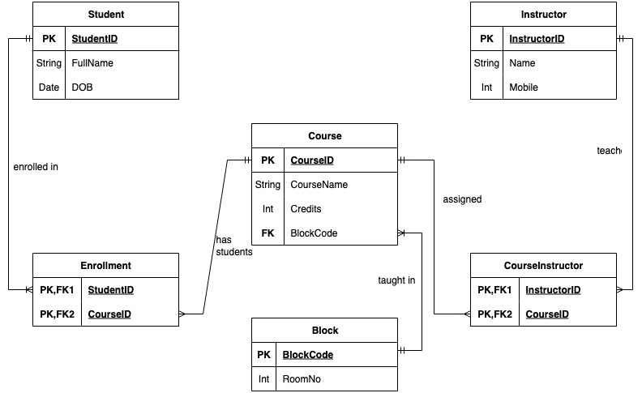

# school-database
DEV1002

## Process

#### 0NF
We started with a pretty bad database with multiple values in cells and with no easy method to identify anything


#### 1NF
To get to first normal form, we needed to make each column atomic and make sure each row is unique by creating an ID column.


#### 2NF
To achieve second normal form, we need to remove all partial dependencies. This was done by separating the table into separate 
related tables with columns that made sense to stay together. Each table was also given an ID column to uniquely identify each row.


#### 3NF
Finally, to achieve third normal form, we removed transitive dependency (RoomNo depends on BlockCode, not directly on Course) by introducing Block and referencing it from Course.

The ID's were also simplified to integers instead of varying characters, so they can be serial and less prone to issues in the future.


### ERD

To solidify our database design, an ERD was created to display the relations and business rules for each table.

#### Schema Overview
* Student (StudentID PK, FullName, DOB)
* Instructor (InstructorID PK, FullName, Mobile)
* Block (BlockCode PK, RoomNo)
* Course (CourseID PK, CourseName, Credits, BlockCode FK→Block)
* Enrollment (PK StudentID, CourseID; FKs → Student, Course)
* CourseInstructor (PK InstructorID, CourseID; FKs → Instructor, Course)



###

## Create Database

Run to create the DB

```createdb -h localhost -U postgres schooldb```

Run to load schema + seed

```psql -h localhost -U postgres -d schooldb -f "./SchoolDB.sql"```